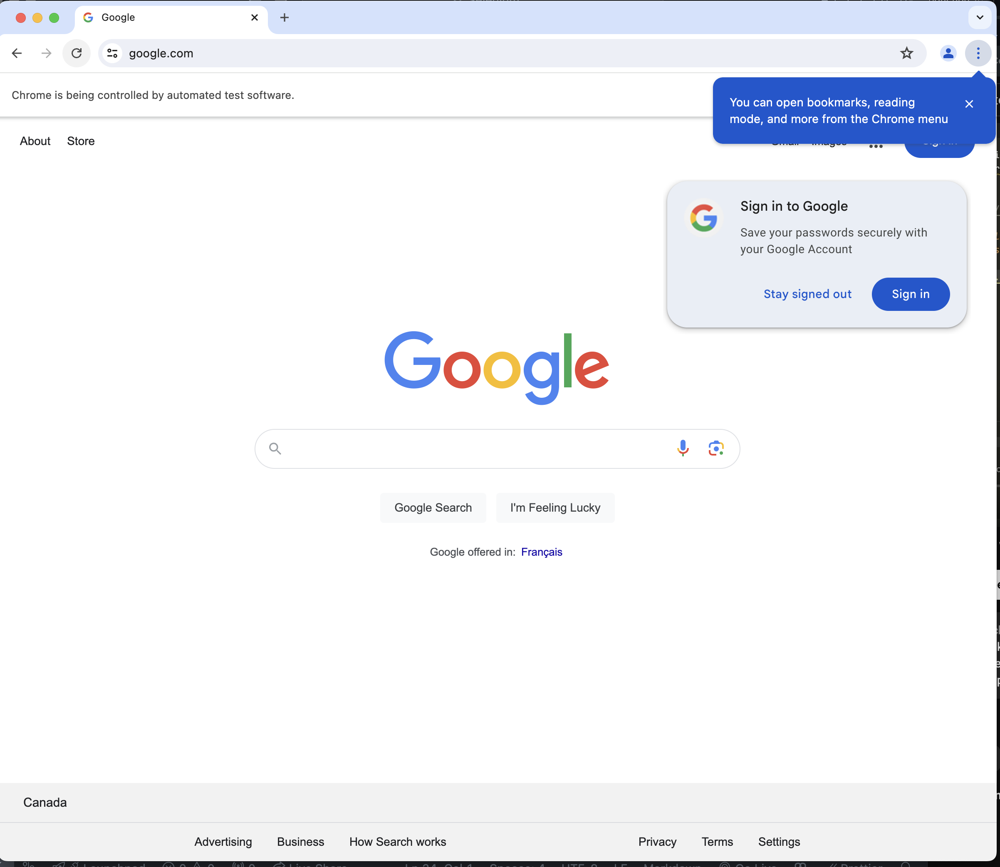

# Selenium Testing 

### Commands to run
* First you need to install a python virtual environment inside the project directory

``` bash
python3 -m venv venv
```
For Macos or Linux:
``` bash
source venv/bin/activate
```
For Windows:
``` bash
.\venv\Scripts\activate
```
Then install Selenium in the python virtual environment
``` bash
pip install selenium
```
Finally run the script:
``` bash
python3 main.py
```

### Requirements
* Python 3.6 or higher
* Selenium
* Chrome Webdriver
* Chrome Browser
* Python Virtual Environment

### Picture
After python main.py, it will automatically open the chrome.


